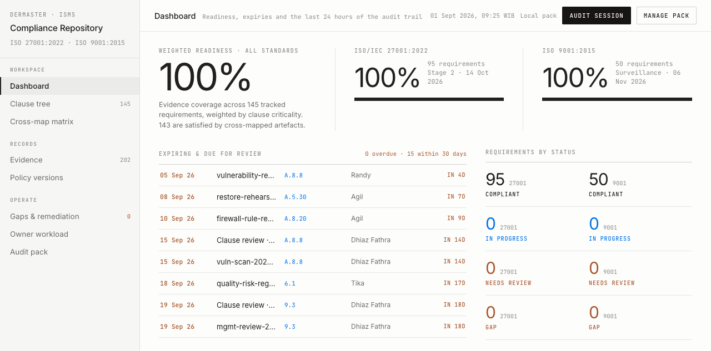
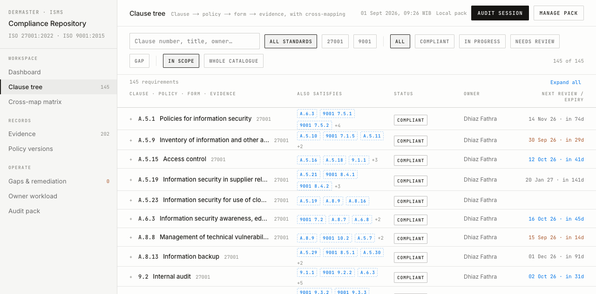
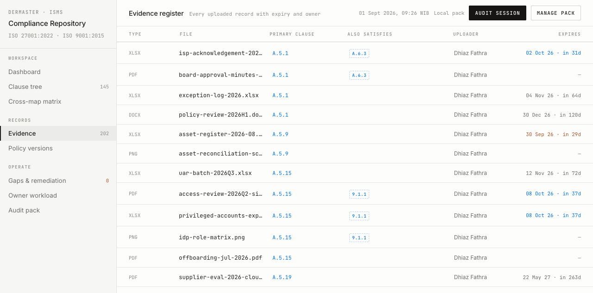
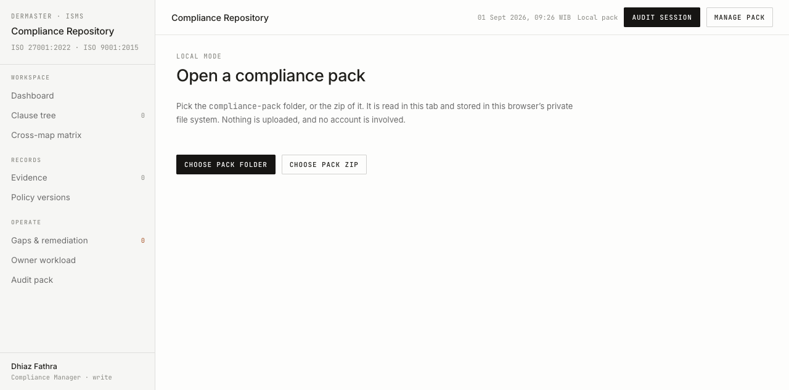
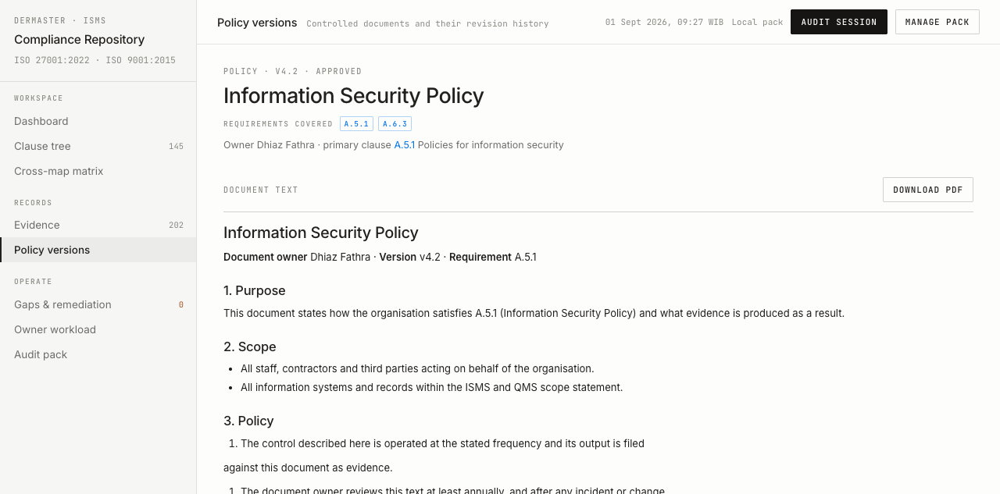

# Evidence: local mode imports the pack as a folder and as a zip

Task: verify `/local/import` accepts both `./compliance-pack/` and
`./compliance-pack.zip`, and that the imported register actually renders.
Backs the fix in commit `eda0f2b` on top of `6df1ed7`.

Both cases **failed on the first run** and pass after the fix. The failure and
its cause are recorded below, because it is the reason this evidence exists.

## The failure found

Case 1 was run against `6df1ed7`. The import reported success and redirected to
`/local`, but every screen showed "Nothing imported yet".

The pack was in fact stored — it was stored one level too deep:

```
npx --yes agent-browser eval "(async()=>{const r=await navigator.storage.getDirectory();const p=await r.getDirectoryHandle('compliance-pack');const n=[];for await (const [k,h] of p.entries()) n.push(k);return JSON.stringify(n)})()"
```

```
"[\"compliance-pack:directory\"]"
```

A folder picker reports `webkitRelativePath` as `compliance-pack/graph.json`.
`parsePack()` tolerates that prefix and strips it internally, so the import
validated. `storePack()` wrote the same paths verbatim under an OPFS root
already named `compliance-pack`, producing
`compliance-pack/compliance-pack/graph.json`, and `loadStoredPack()` looks for
`graph.json` at the root — so it found nothing and returned `undefined`.

Root cause: the prefix was stripped in the parser only, not at the point both
readers converge. Fix: `packPrefix()` is exported from `src/lib/pack.ts` and
used by both `parsePack()` and `storePack()`, so the pack is stored the same
way it is read. Covered by four `packPrefix` cases in `tests/pack.test.ts`.

## Setup

```bash
cd /Users/dhiazfathra/Documents/GitHub/dhiazfathra/iso-compliance-kms
bun run export:pack
rm -f compliance-pack.zip && zip -rq compliance-pack.zip compliance-pack -x '.*'
bun run build
PORT=3111 bun run start &
```

```
Wrote 369 files (4.1 MB) to /Users/dhiazfathra/Documents/GitHub/dhiazfathra/iso-compliance-kms/compliance-pack
  145 requirements · 160 documents · 202 records
EXIT=0

compliance-pack.zip  1.0M
  4112935  372 files

▲ Next.js 16.3.3
- Local:  http://localhost:3111
✓ Ready in 130ms
```

Readiness check:

```bash
curl -s -o /dev/null -w "%{http_code}" http://localhost:3111/local/import
```

```
200
```

## Case 1 — the `compliance-pack/` folder

```bash
npx --yes agent-browser record start docs/evidence/0001-local-mode-pack-import/case1-folder-import.webm http://localhost:3111/local/import
npx --yes agent-browser upload 'input[webkitdirectory]' "$PWD/compliance-pack"
npx --yes agent-browser get url
```

```
✓ Recording started: docs/evidence/0001-local-mode-pack-import/case1-folder-import.webm
✓ Done
http://localhost:3111/local
```

Stored layout — `graph.json` at the pack root, no nesting:

```bash
npx --yes agent-browser eval "(async()=>{const r=await navigator.storage.getDirectory();const p=await r.getDirectoryHandle('compliance-pack');const n=[];for await (const [k,h] of p.entries()) n.push(k);return JSON.stringify(n.sort())})()"
```

```
"[\"MANIFEST.txt\",\"clauses.csv\",\"cross-map.csv\",\"evidence\",\"evidence.csv\",\"gaps.csv\",\"graph.json\",\"index.html\",\"policies\"]"
```

Dashboard after the import:

```bash
npx --yes agent-browser eval "document.body.innerText.replace(/\n+/g,' | ').slice(0,700)"
```

```
"DERMASTER · ISMS | Compliance Repository | ISO 27001:2022 · ISO 9001:2015 | WORKSPACE | Dashboard | Clause tree | 145 | Cross-map matrix | RECORDS | Evidence | 202 | Policy versions | OPERATE | Gaps & remediation | 0 | Owner workload | Audit pack | Dhiaz Fathra | Compliance Manager · write | Dashboard | Readiness, expiries and the last 24 hours of the audit trail | 01 Sept 2026, 09:25 WIB | Local pack | AUDIT SESSION | MANAGE PACK | WEIGHTED READINESS · ALL STANDARDS | 100% | Evidence coverage across 145 tracked requirements, weighted by clause criticality. 143 are satisfied by cross-mapped artefacts. | ISO/IEC 27001:2022 | 100% | 95 requirements | Stage 2 · 14 Oct 2026 | ISO 9001:2015 | 100"
```

`145` requirements and `202` records match what `export:pack` wrote, so the
counts come from the imported pack and not from a fallback.

## Case 2 — `compliance-pack.zip`

Run in a fresh browser session with OPFS cleared first, so nothing from case 1
can be mistaken for a successful zip import.

```bash
npx --yes agent-browser close --all
npx --yes agent-browser record start docs/evidence/0001-local-mode-pack-import/case2-zip-import.webm http://localhost:3111/local/import
npx --yes agent-browser eval "(async()=>{const r=await navigator.storage.getDirectory();await r.removeEntry('compliance-pack',{recursive:true}).catch(()=>{});return 'wiped'})()"
npx --yes agent-browser upload 'input[accept=".zip,application/zip"]' "$PWD/compliance-pack.zip"
npx --yes agent-browser get url
```

```
✓ Closed session: default
✓ Recording started: docs/evidence/0001-local-mode-pack-import/case2-zip-import.webm
"wiped"
✓ Done
http://localhost:3111/local
```

Stored layout — byte-identical shape to case 1, which is the point of the one
parser:

```
"[\"MANIFEST.txt\",\"clauses.csv\",\"cross-map.csv\",\"evidence\",\"evidence.csv\",\"gaps.csv\",\"graph.json\",\"index.html\",\"policies\"]"
```

```
"DERMASTER · ISMS | Compliance Repository | ISO 27001:2022 · ISO 9001:2015 | WORKSPACE | Dashboard | Clause tree | 145 | Cross-map matrix | RECORDS | Evidence | 202 | Policy versions | OPERATE | Gaps & remediation | 0 | Owner workload | Audit pack | Dhiaz Fathra | Compliance Manager · write | Dashboard | Readiness, expiries and the last 24 hours of the audit trail | 01 Sept 2026, 09:26 WIB | Local pack | AUDIT SESSION"
```

The zip carries a `compliance-pack/` top-level directory, exactly like the
folder picker's paths, so it exercises the same prefix path that broke.

A stored document renders from the pack's own file bytes, not just from
`graph.json`:

```bash
npx --yes agent-browser open http://localhost:3111/local/policies/1
npx --yes agent-browser eval "document.body.innerText.replace(/\n+/g,' | ').slice(300,900)"
```

```
"versions | Controlled documents and their revision history | 01 Sept 2026, 09:27 WIB | Local pack | AUDIT SESSION | MANAGE PACK | POLICY · V4.2 · APPROVED | Information Security Policy | REQUIREMENTS COVERED | A.5.1 | A.6.3 | Owner Dhiaz Fathra · primary clause A.5.1 Policies for information security | DOCUMENT TEXT | DOWNLOAD PDF | Information Security Policy | Document owner Dhiaz Fathra · Version v4.2 · Requirement A.5.1 | 1. Purpose | This document states how the organisation satisfies A.5.1 (Information Security Policy) and what evidence is produced as a result. | 2. Scope | All staff, co"
```

## Suite after the fix

```bash
bun test && bun run typecheck && bun run lint
```

```
 157 pass
 0 fail
 7795 expect() calls
Ran 157 tests across 15 files. [924.00ms]
$ tsc --noEmit
$ eslint .
```

## Screenshots / video

Case 1 — the import screen before anything is picked; both pickers present, no
pack stored:


Case 1 — the dashboard after picking the folder. Look at the sidebar counts
(`145` clause tree, `202` evidence) and the 100% readiness computed from the
imported register; on `6df1ed7` this screen read "Nothing imported yet":



Case 1 — the clause tree, proving the register is navigable and not just a
count on a card:



Case 1 — the evidence register:



Case 2 — the import screen in a fresh session with OPFS cleared:



Case 2 — the dashboard after importing the zip; identical counts to case 1:


Case 2 — a controlled document rendered from the file bytes inside the zip:



Walkthroughs of each flow end to end:

- [`case1-folder-import.webm`](./case1-folder-import.webm) — 50.8 s, 536 KB
- [`case2-zip-import.webm`](./case2-zip-import.webm) — 60.4 s, 519 KB

```bash
ffprobe -v error -show_entries format=duration,size -of default=nw=1 case1-folder-import.webm
ffprobe -v error -show_entries format=duration,size -of default=nw=1 case2-zip-import.webm
```

```
duration=50.800000
size=548413
duration=60.400000
size=531826
```

## Cleanup

```bash
npx --yes agent-browser close --all
lsof -ti:3111 | xargs kill -9
```

`compliance-pack/`, `compliance-pack.zip` and the browser's OPFS copy are all
disposable — `bun run export:pack` regenerates the first two, and the third is
recreated by re-importing. None of them are tracked.
