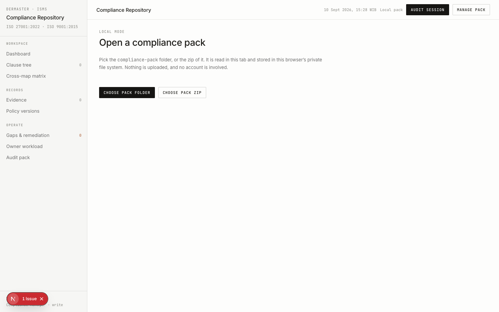
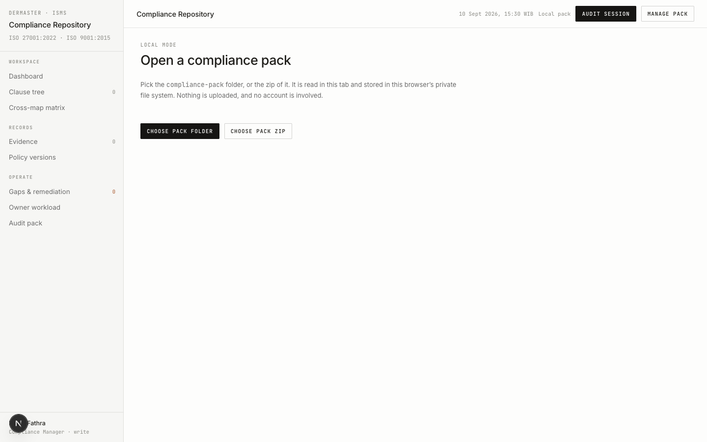

# Evidence: the root hydration attribute mismatch is gone

Task: fix the React hydration error that fired on every page load
(commit `886d61a`, PR #2). Compared against its parent `271a9e2`.

## Why this needs a simulated extension

The mismatching attribute was `data-google-analytics-opt-out=""` on `<html>`.
Nothing in this repo writes it and Next.js does not emit it — the Google
Analytics Opt-out browser extension stamps it onto the document before React
hydrates. A clean headless browser has no extension, so the bug is
**unreproducible** there: no injected attribute, no mismatch, no error. Testing
the fix without simulating the extension would prove nothing, because the
console is silent either way.

So the harness injects the attribute itself, at document-start, via
[`inject-ga-optout.js`](./inject-ga-optout.js). The first attempt at that
script set the attribute directly and silently did nothing — an init script
runs before the document is parsed, so `document.documentElement` is still
`null` and the assignment throws. The committed version watches the empty
document and attaches the attribute the instant `<html>` appears, which is
comfortably before the hydration pass.

## It must run in dev mode

The verbose "A tree hydrated but some attributes..." text is a
development-only React warning. A production `next build` would not print it,
so a build-based A/B would show two silent consoles and prove nothing.

## Route under test

`/local/import` renders `LocalLayout` and is a pure client component with no
Payload or database access, so it serves without a `.env` or a seeded DB
(HTTP 200 confirmed below). `/` sits behind `requireUser()`.

**Scope limit, stated plainly:** this exercises `LocalLayout` only. The other
two root layouts (`(app)/layout.tsx`, `(auth)/layout.tsx`) received the
byte-identical one-line change but were not themselves loaded in a browser
here.

## Setup

Two detached worktrees, one per side of the comparison, so neither touches the
main working tree:

```bash
git worktree add --detach /tmp/before 271a9e2   # parent, unfixed
git worktree add --detach /tmp/after  886d61a   # the fix
```

`node_modules` must be a real directory in each worktree. Symlinking it to the
main checkout fails — Turbopack rejects it outright:

```text
Error [TurbopackInternalError]: Symlink [project]/node_modules is invalid, it points out of the filesystem root
```

```bash
cd /tmp/before && bun install --frozen-lockfile   # 667 packages installed [23.14s]
cp -Rl /tmp/before/node_modules /tmp/after/node_modules   # hardlinks, no second install
cd /tmp/before && bun run dev --port 3112 &
cd /tmp/after  && bun run dev --port 3111 &
```

Both came up on Next.js 16.3.3 (Turbopack), `✓ Ready in ~400ms`, and both
serve the route:

```bash
$ curl -s -o /dev/null -w "http_status=%{http_code}\n" http://localhost:3112/local/import
http_status=200
$ curl -s -o /dev/null -w "http_status=%{http_code}\n" http://localhost:3111/local/import
http_status=200
```

## Before — parent commit `271a9e2`, extension simulated

```bash
npx --yes agent-browser close --all
npx --yes agent-browser open --init-script ./inject-ga-optout.js http://localhost:3112/local/import
npx --yes agent-browser wait 3000
npx --yes agent-browser eval "document.documentElement.outerHTML.slice(0,220)"
npx --yes agent-browser console
```

The injection landed — the attribute is on `<html>`:

```text
"<html lang=\"en\" class=\"inter_dfa45f92-module__ig9XPW__variable jetbrains_mono_70b60163-module__7Ns5vW__variable\" data-google-analytics-opt-out=\"\"><head><meta charset=\"utf-8\"><meta name=\"viewport\" content=\"width=device-wi"
```

Console output, verbatim:

```text
[info] %cDownload the React DevTools for a better development experience: https://react.dev/link/react-devtools font-weight:bold
[log] [HMR] connected
[error] A tree hydrated but some attributes of the server rendered HTML didn't match the client properties. This won't be patched up. This can happen if a SSR-ed Client Component used:

- A server/client branch `if (typeof window !== 'undefined')`.
- Variable input such as `Date.now()` or `Math.random()` which changes each time it's called.
- Date formatting in a user's locale which doesn't match the server.
- External changing data without sending a snapshot of it along with the HTML.
- Invalid HTML tag nesting.

It can also happen if the client has a browser extension installed which messes with the HTML before React loaded.

%s%s https://react.dev/link/hydration-mismatch 

  ...
    <RenderFromTemplateContext>
      <ScrollAndMaybeFocusHandler cacheNode={{rsc:{...}, ...}}>
        <InnerScrollHandlerNew focusAndScrollRef={{scrollRef:null, ...}} cacheNode={{rsc:{...}, ...}}>
          <ErrorBoundary errorComponent={undefined} errorStyles={undefined} errorScripts={undefined}>
            <LoadingBoundary name="/" loading={null}>
              <HTTPAccessFallbackBoundary notFound={{...}} forbidden={undefined} unauthorized={undefined}>
                <HTTPAccessFallbackErrorBoundary pathname="/local/import" notFound={{...}} forbidden={undefined} ...>
                  <RedirectBoundary>
                    <RedirectErrorBoundary router={{...}}>
                      <InnerLayoutRouter url="/local/import" tree={[...]} params={{}} cacheNode={{rsc:{...}, ...}} ...>
                        <SegmentViewNode type="layout" pagePath="local/layo...">
                          <SegmentTrieNode>
                          <link>
                          <script>
                          <LocalLayout>
                            <html
                              lang="en"
                              className="inter_dfa45f92-module__ig9XPW__variable jetbrains_mono_70b60163-module__7Ns5v..."
-                             data-google-analytics-opt-out=""
                            >
                      ...
          ...

```

The last line of React's own diff names the culprit exactly:
`- data-google-analytics-opt-out=""` directly under `<html ...>`. This is the
empirical confirmation of the diagnosis — before this capture it rested on
reading the layouts and ruling the alternatives out.



## After — commit `886d61a`, same injection, same route

```bash
npx --yes agent-browser close --all
npx --yes agent-browser open --init-script ./inject-ga-optout.js http://localhost:3111/local/import
npx --yes agent-browser wait 3000
npx --yes agent-browser eval "document.documentElement.hasAttribute('data-google-analytics-opt-out')"
npx --yes agent-browser console
```

The attribute is still being injected — this is not a case of the simulation
having stopped working:

```text
true
```

Console output, verbatim:

```text
[info] %cDownload the React DevTools for a better development experience: https://react.dev/link/react-devtools font-weight:bold
[log] [HMR] connected
```

Only the React DevTools notice and the HMR line remain. Grepping the captured
console for the string `hydrat` returns `0` matches.



## Cleanup

```bash
npx --yes agent-browser close --all
lsof -ti:3111 -ti:3112 | xargs kill -9
git worktree remove --force /tmp/before && git worktree remove --force /tmp/after
```
